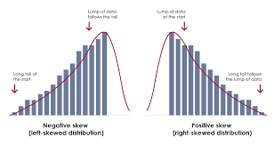
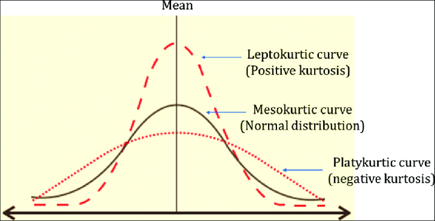

# Descriptive Statistics

**Mushfikur R. Mahi**  
Department of Economics  
Bangladesh National University  
\date{\today}

## Introduction
**Descriptive statistics** is a branch of statistics that focuses on summarizing and describing the features of a dataset. It provides a way to present large amounts of data in a simplified, more digestible form. Descriptive statistics help you understand the basic characteristics of your data without making conclusions beyond the data at hand (which would be inferential statistics). In this section, we will explore the following key topics, which are essential for data science:

1. Mean, Median, Mode
2. Variance, Standard Deviation
3. Skewness and Kurtosis
4. Percentiles and Quartiles

### Mean
In mathematics and statistics, the **mean** is a measure of central tendency, commonly referred to as the "average." It is calculated by summing all the values in a dataset and then dividing by the number of values. The formula for the mean is,

\[
\text{Mean}(\mu) = \frac{\sum_{i=1}^{N} x_i}{N}
\]
Here, 
- \(\mu = \text{mean}\)
- \(x_i = \text{Each\;data\;point}\)
- \(N = \text{Total\;number\;of\;observations}\)

### Median
The **median** is another measure of central tendency that represents the middle value of a dataset when the values are arranged in ascending or descending order. If the dataset has an odd number of observations, the median is the middle value. If the dataset has an even number of observations, the median is the average of the two middle values. The formula for the median is:

**If \( N \) is odd:**

\[
\text{Median} = \text{Value\;of\;}\left(\frac{N+1}{2}\right)\text{th\;observation}
\]

**If \( N \) is even:**

\[
\text{Median} = \frac{\text{Value of } \left(\frac{N}{2}\right)\text{th observation + Value of } \left(\frac{N}{2}+1\right)\text{th observation}}{2}
\]

Here, 
- \(N = \text{Total\;number\;of\;observations}\)

### Mode
The **mode** is the value that appears most frequently in a dataset. A dataset may have one mode, more than one mode, or no mode at all. The mode is useful for understanding the most common value within the dataset. There is no specific formula for calculating mode; it is determined by counting the frequency of each value. For grouped data, the formula for calculating the mode is given by:

\[
\text{Mode} = L + \left( \frac{f_1 - f_0}{2f_1 - f_0 - f_2} \right) \times h
\]

Where:
- \(L\): The lower boundary of the modal class (the class with the highest frequency).
- \(f_1\): The frequency of the modal class (the highest frequency).
- \(f_0\): The frequency of the class preceding the modal class.
- \(f_2\): The frequency of the class succeeding the modal class.
- \(h\): The width of the modal class interval (the difference between the upper and lower boundaries of the modal class).

### Variance
**Variance** measures the spread or dispersion of a set of data points around the mean. It quantifies how much the data points deviate from the mean value. The formula for variance is:

**Population Variance:**
\[
\sigma^2 = \frac{\sum_{i=1}^{N} (x_i - \mu)^2}{N}
\]
Here,
- \(\sigma^2 = \text{Population\;variance}\)

**Sample Variance:**
\[
s^2 = \frac{\sum_{i=1}^{n} (x_i - \bar{x})^2}{n-1}
\]
Here,
- \(s^2 = \text{Sample\;variance}\)
- \(\bar{x} = \text{Sample\;mean}\)
- \(n = \text{Sample\;size}\)

### Standard Deviation
The **standard deviation** is the square root of the variance and provides a measure of how spread out the values in a dataset are relative to the mean. It is expressed in the same units as the original data. The formulas for standard deviation are:

**Population Standard Deviation:**
\[
\sigma = \sqrt{\sigma^2} = \sqrt{\frac{\sum_{i=1}^{N} (x_i - \mu)^2}{N}}
\]

**Sample Standard Deviation:**
\[
s = \sqrt{s^2} = \sqrt{\frac{\sum_{i=1}^{n} (x_i - \bar{x})^2}{n-1}}
\]

Here,
- \(\sigma = \text{Population\;standard\;deviation}\)
- \(s = \text{Sample\;standard\;deviation}\)
- \(\mu = \text{Population\;mean}\)
- \(\bar{x} = \text{Sample\;mean}\)
- \(N = \text{Total\;number\;of\;observations\;(population)}\)
- \(n = \text{Total\;number\;of\;observations\;(sample)}\)

### Skewness
**Skewness** measures the asymmetry of the probability distribution of a real-valued random variable about its mean. It indicates whether data points are skewed to the left (negative skewness) or to the right (positive skewness).

The formulas for skewness are as follows:

**Population Skewness:**
\[
\text{Skewness} (\gamma) = \frac{1}{N} \sum_{i=1}^{N} \left(\frac{x_i - \mu}{\sigma}\right)^3
\]

**Sample Skewness:**
\[
\text{Skewness} (g_1) = \frac{n}{(n-1)(n-2)} \sum_{i=1}^{n} \left(\frac{x_i - \bar{x}}{s}\right)^3
\]

Where:
- \(\mu\): Population mean
- \(\bar{x}\): Sample mean
- \(\sigma\): Population standard deviation
- \(s\): Sample standard deviation
- \(N\): Total number of observations in the population
- \(n\): Total number of observations in the sample

**Example:**  
In a dataset of test scores, if most students score below the average, the distribution will be negatively skewed. Conversely, if a few students score exceptionally high while the majority score lower, the distribution is positively skewed. 

### Kurtosis
**Kurtosis** measures the "tailedness" of the probability distribution of a real-valued random variable. It indicates how much of the variance is due to extreme values (outliers) in the distribution. In essence, kurtosis tells us about the shape of the distribution concerning its tails and peak.

The formulas for kurtosis are:

**Population Kurtosis:**
\[
\text{Kurtosis} (\beta) = \frac{1}{N} \sum_{i=1}^{N} \left(\frac{x_i - \mu}{\sigma}\right)^4 - 3
\]

**Sample Kurtosis:**
\[
\text{Kurtosis} (g_2) = \frac{n(n+1)}{(n-1)(n-2)(n-3)} \sum_{i=1}^{n} \left(\frac{x_i - \bar{x}}{s}\right)^4 - \frac{3(n-1)^2}{(n-2)(n-3)}
\]

Where:
- \(\mu\): Population mean
- \(\bar{x}\): Sample mean
- \(\sigma\): Population standard deviation
- \(s\): Sample standard deviation
- \(N\): Total number of observations in the population
- \(n\): Total number of observations in the sample

**Types of Kurtosis:**

1. **Mesokurtic:** This type has a kurtosis value close to 0 (or 3 when using the excess kurtosis formula). The distribution resembles the normal distribution and has moderate tails and a moderate peak.  
   **Example:** The normal distribution itself is a classic example of a mesokurtic distribution.

2. **Leptokurtic:** Leptokurtic distributions have positive kurtosis (greater than 0). They have heavier tails and a sharper peak than the normal distribution, indicating a higher likelihood of extreme values (outliers).  
   **Example:** Stock returns often display leptokurtic behavior, as they may have more extreme movements than what a normal distribution would suggest.

3. **Platykurtic:** Platykurtic distributions have negative kurtosis (less than 0). They are characterized by lighter tails and a flatter peak compared to the normal distribution, indicating fewer extreme values.  
   **Example:** A uniform distribution is an example of a platykurtic distribution, as values are evenly spread out with no peaks.

### Percentiles and Quartiles
**Percentiles** are measures used to understand the relative standing of a value within a dataset. A percentile indicates the value below which a certain percentage of the data falls. For example, the 70th percentile means that 70% of the data is below that value.

The formula to calculate the \(k\)th percentile is:

\[
P_k = \left(\frac{k}{100} \times (N + 1)\right)
\]

Where:
- \(P_k\): The \(k\)th percentile
- \(k\): The desired percentile (0 < \(k\) < 100)
- \(N\): Total number of observations

**Quartiles** are special cases of percentiles, dividing the dataset into four equal parts:

1. **First Quartile (Q1):** 25th percentile
2. **Second Quartile (Q2):** 50th percentile (Median)
3. **Third Quartile (Q3):** 75th percentile

**Example of Quartiles:**

If we have the dataset: 10, 20, 30, 40, 50, 60, 70, 80, 90

- **Q1 (25th percentile):** The median of the first half (10, 20, 30, 40): Q1 = 25
- **Q2 (50th percentile):** The median of the dataset: Q2 = 50
- **Q3 (75th percentile):** The median of the second half (50, 60, 70, 80, 90): Q3 = 75

In summary, descriptive statistics provides essential tools for understanding and interpreting data. It allows us to summarize key characteristics and gain insights, forming the basis for further analysis and decision-making.

### Conclusion
In conclusion, descriptive statistics is crucial in data analysis as it provides insights into the characteristics of a dataset. By understanding measures like mean, median, mode, variance, standard deviation, skewness, kurtosis, and percentiles, we can better interpret the data and make informed decisions.

### References
1. Sullivan, M. (2019). Statistics: Informed Decisions Using Data. Pearson.
2. Triola, M. F. (2018). Elementary Statistics. Pearson.
3. McClave, J. T., & Sincich, T. (2018). Statistics. Pearson.
4. Freedman, D., Pisani, R., & Purves, R. (2014). Statistics. W. W. Norton & Company.
